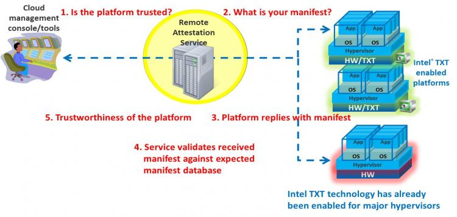
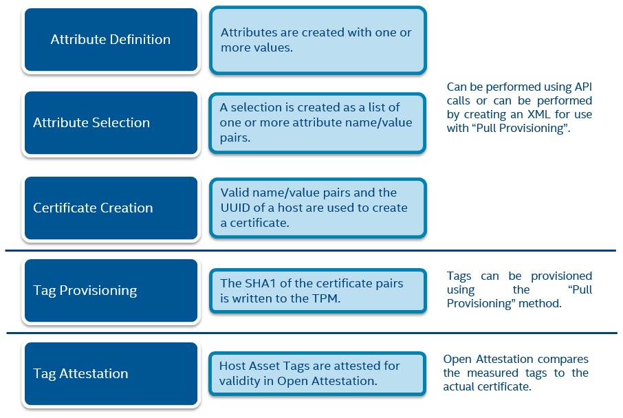
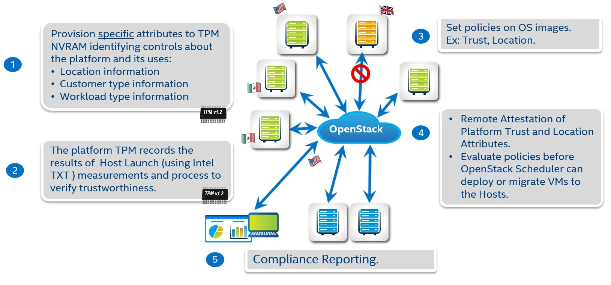

**This project provides:** A cloud management tool software development kit (SDK) source code and binaries

**The value of the OpenAttestation project**

This project provides an SDK to create cloud management tools. These tools are capable of establishing the hosts’ integrity information by remotely retrieving and verifying integrity with Trusted Platform Module (TPM) quotes. OpenStack and oVirt both use OpenAttestation.

Key features include:

* Support for major Linux host operating systems
* PCR-based report schema and policy rules
* RESTful based Query API
* Reference web portal/GUI implementation
* Historical PCRs data tracking/comparison
* Whitelist management
* Flexible access control to attestation server
* Supports Tomcat 2-way SSL/TLS for Query APIs
* Hook for ISVs to implement custom access control
* Asset Tag
* SAML Reports
* Open Stack extension with Asset Tag

**What is Asset Tag?**

The Asset Tag Management service leverages Intel TXT-enabled processors to securely write Administrator-defined descriptors to the hardware. These values can be made visible in the datacenter by using the Open Attestation and can then be used to provide workload verification, remediation, reporting, and compliance in both public and private cloud environments.

**Which is the workflow of asset tag?**

The following image shows an overview of how to asset tag a host:

**Open Attestation also works with Open Stack**

There is also an extension of Open Attestation that shows if a host that exists in an Open Stack node is trusted or not, the next image shows an overview of how this works:

**Who it’s for?**

This toolkit is available for cloud distributing OEMs, operating system vendors, and system builders. OpenAttestation is used by OpenStack, oVirt, Fedora, Ubuntu, and Red Hat Enterprise Linux.

**Project specifics**

This project is distributed under the BSD license.

**About Intel involvement**

These open source optimizations are used in servers featuring Intel® Atom™ processors, Intel® Xeon® processors, and Intel® Xeon Phi™ coprocessors.

For more information or contact with the admins of this project please visit Open Attestation web site:
* https://01.org/OpenAttestation